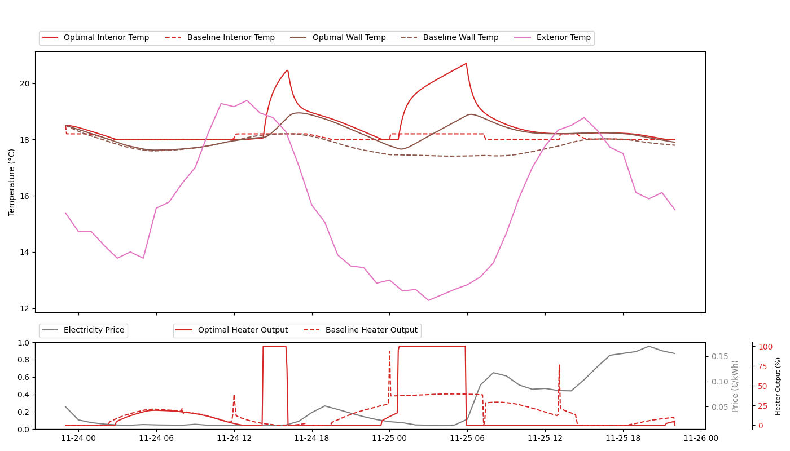
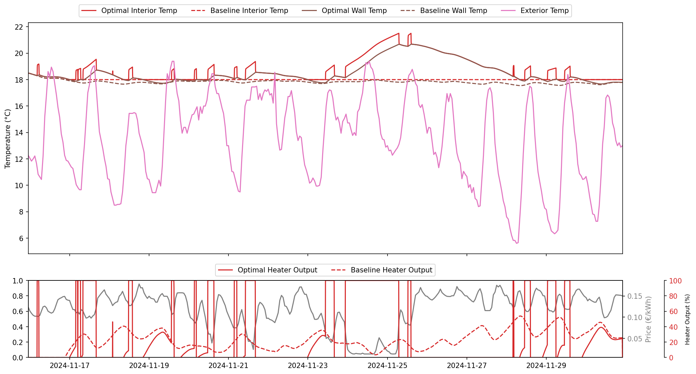
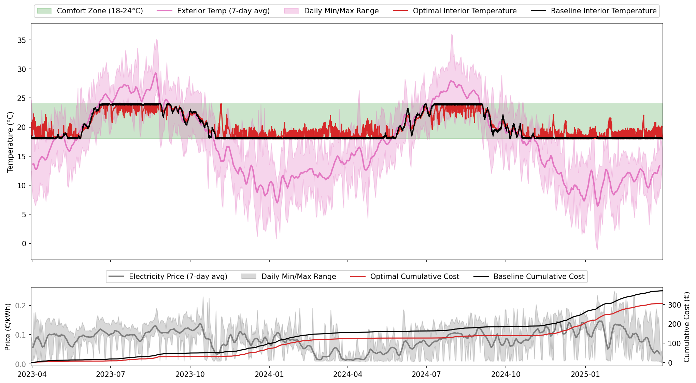

<link rel="stylesheet" href="style.css">

# Smart Heating Optimisation · Barcelona

  
tl;dr

  

    A physics model of a Barcelona apartment, a linear programme, and a €15 smart plug. Run every hour against day-ahead electricity prices and a 48-hour weather forecast, the system finds the cheapest heating schedule that keeps the flat inside the comfort band at all times — <strong>hard constraint, not a soft penalty.</strong>
  

  <ul class="tldr-findings">
    <li><strong>27% lower electricity cost</strong> over two years vs. a reactive thermostat — €152 saved while buying <em>more</em> energy.</li>
    <li><strong>Zero comfort violations</strong> across 17,568 hours and two full heating seasons. The comfort band is a hard LP constraint.</li>
    <li><strong>Shoulder seasons dominate.</strong> October and September savings reach 80–99%; deep winter drops to 14–22% because the heater runs nearly full-time regardless.</li>
    <li><strong>Buying more can cost less.</strong> During the cheap-price window of 23–29 November the optimizer bought 98 kWh vs. the thermostat's 78 kWh — and cut the bill by 48%.</li>
    <li><strong>Thermal mass is the storage medium.</strong> The wall's 7-day time constant ($\tau_{wall} \approx 7$ days) lets the optimizer pre-charge the house and coast through expensive hours with no discomfort.</li>
  </ul>

---

## 0. The Story

My friend [Jan](https://janbalanya.com/) has a problem most people never notice they could have. He's on a dynamic electricity tariff, which means the price of power changes every hour — dirt cheap at 3 a.m., painfully expensive through the morning rush. He also owns an ordinary plug-in heater, and a reasonable wish: heat the flat when electricity is cheap, not just when he happens to feel cold, and do it without checking an app every hour. That modest wish is the seed of this whole project — and it turns out to lean on more physics than you'd expect.

The result is a full-stack system with four parts: it pulls price and weather forecasts from APIs, models the building's thermal behaviour, solves for the cheapest schedule that stays comfortable, and sends the on/off commands to a smart plug. Forecast in, plug command out.

---

## 1. The Business Perspective

The price swings are not noise; they have a cause. Renewable generation is cheap but weather-bound: solar overproduction drives the wholesale price toward zero on sunny afternoons, and demand peaks push it back up. A flat tariff hides this from most consumers. A dynamic tariff passes it straight through — which is exactly what makes those swings something you can act on.

The opening this creates is load shifting: buy energy when it's cheap, not at the moment you happen to need it. Heating is an unusually good candidate, because a building comes with slack built in — a few degrees of comfort and a few hours of thermal inertia stand between "heat now" and "too cold." That slack is the room to maneuver. The whole job of the optimizer is to use it deliberately instead of letting it go to waste.

Stated plainly, the objective is almost boring: spend as little as possible on electricity while keeping the indoor temperature inside a comfort band at all times. The reason it stays tractable is that, with a linear model of the building, this is a linear programme — so we get the global optimum exactly, quickly, and in a form we can actually read and explain. The "at all times" is doing quiet but heavy lifting here.

---

## 2. How the Building Works as a Battery

Electricity is perishable in a way most goods are not: the grid has to match supply and demand at every instant, with almost no buffer in between. That is the real reason cheap power at 3 a.m. is so hard to use at 9 a.m. — you cannot just set it aside. But a house can. Heat its thermal mass while power is cheap and it releases that warmth over the following hours; the structure itself becomes the battery, storing energy as temperature instead of charge.

Each part of the building obeys the same physics — Newton's law of cooling:

$$C \frac{dT_{\text{interior}}}{dt} = \frac{T_{\text{exterior}} - T_{\text{interior}}}{R} + Q$$

| Symbol | Meaning | Units |
|---|---|---|
| $C$ | Heat capacity: energy needed to raise temperature by 1°C | kWh/°C |
| $R$ | Thermal resistance: how hard heat flows between two regions | °C/kW |
| $T$ | Temperature (interior, exterior, etc.) | °C |
| $\tau = R \cdot C$ | Timescale: time to halve a temperature gap | h |
| $Q$ | Net thermal power injected into the interior | kW |

The injected power $Q$ is the *net* thermal flow — positive when heating, negative when cooling. In practice we never command a signed power directly; we split it into the difference of two non-negative duty cycles,

$$Q = Q_h\,\alpha_h(t) - Q_c\,\alpha_c(t),$$

where $Q_h, Q_c$ are the heater and cooler nominal powers and $\alpha_h, \alpha_c \in [0,1]$ are their PWM duty cycles. The split is not cosmetic: keeping heating and cooling as two independent non-negative variables is what keeps the problem linear. A single signed $Q$ would force the optimizer to decide its own sign — exactly the kind of either/or a linear programme cannot express.

So far we have treated the house as a single lump of mass, but that hides the mechanism that makes the whole scheme work. A home is really a shell: a thin envelope of air — the part we actually want to keep comfortable — wrapped inside far heavier walls. The heater warms the air, the air warms the walls, and only then does heat slowly leak outside.

That leaves us two lumps worth tracking, and they live on completely different clocks. The air heats and cools in minutes; the walls take days to fully charge or discharge. Between them sits a thermal resistance measuring how readily heat crosses from one to the other, and a second resistance to the outside that is really just a number for how well the flat is insulated.

And it is the wall, not the air, that does the heavy lifting. Pre-heating that slow, massive reservoir is what buys the long coasting time inside the comfort zone — the stretch when the heater is off and the room stays warm anyway. That single fact is what the rest of this project is built to exploit.

---

## 3. The Physical Model

### 3.0 Which Model to Use?

Once we commit to lumped masses, two natural options present themselves:

| Model | What it captures | The trade-off |
|---|---|---|
| **1R1C** | Single air+wall lump | Simple and useful for grid-scale aggregation, but misses the air/wall split — it cannot tell how warm people actually feel inside |
| **2R2C** | Air + wall | Two time constants, still linear; captures the heat-battery effect that drives both comfort and cost |

> *Beyond lumped models lie full spatial simulations — FEM tools like EnergyPlus that resolve geometry and every localized heat leak. They are more accurate and far more expensive, which makes them the right tool for design and certification and the wrong one for a controller that has to re-solve every few minutes.*

2R2C is the smallest model that still tells us what we need: by separating the fast-responding air from the slow thermal reservoir, it captures the one effect that comfort and cost both hinge on. It is also linear — the property that lets the cost-minimization in §4 be solved exactly, with the comfort band entered as a hard constraint rather than a soft penalty we merely hope the optimizer respects.

### 3.1 Two Equations

The cleanest way to see the model is as a circuit: thermal masses become capacitors, insulation layers become resistors, and the heater and cooler are current sources injecting energy. Newton's law at each node then hands us one differential equation per part — no modeling left to taste.

For the air:
$$C_{air} \frac{dT_{air}}{dt} = \frac{T_{wall} - T_{air}}{R_{int}} + Q_h\,\alpha_h(t) - Q_c\,\alpha_c(t)$$

For the wall:
$$C_{wall} \frac{dT_{wall}}{dt} = \frac{T_{air} - T_{wall}}{R_{int}} + \frac{T_{ext} - T_{wall}}{R_{ext}}$$

Read them as a pair of flows: the air node takes the net injection from heater and cooler — both with non-negative duty cycles $\alpha_h, \alpha_c \in [0,1]$ — and trades heat with the wall. The wall, in turn, trades with the air and leaks slowly to the outside. Nothing else couples to anything, which is exactly why the system stays this small.

### 3.2 Matrix Form

Stacked into a single system:

$$\frac{d\mathbf{T}(t)}{dt} = A\,\mathbf{T}(t) + B\,\mathbf{u}(t) + \mathbf{d}(t)$$

| Symbol | What it is |
|---|---|
| $\mathbf{T}(t) = [T_{air}(t),\ T_{wall}(t)]^\top$ | The two temperatures (the system's state) |
| $\mathbf{u}(t) = [\alpha_h(t),\ \alpha_c(t)]^\top$, $\alpha_h, \alpha_c \in [0,1]$ | Heater and cooler duty cycles |
| $A$ | How temperatures drive each other; off-diagonals are heat pathways, diagonals are loss rates |
| $B$ | Input-gain matrix. Only the air row is excited by the current actuators |
| $\mathbf{d}(t)$ | Exterior temperature forcing |

$$A = \begin{pmatrix} -\dfrac{1}{R_{int} C_{air}} & \dfrac{1}{R_{int} C_{air}} \\[8pt] \dfrac{1}{R_{int} C_{wall}} & -\dfrac{\frac{1}{R_{int}} + \frac{1}{R_{ext}}}{C_{wall}} \end{pmatrix}, \qquad B = \begin{pmatrix} \dfrac{Q_h}{C_{air}} & -\dfrac{Q_c}{C_{air}} \\[8pt] 0 & 0 \end{pmatrix}$$

With the actual parameter values:

$$A \approx \begin{pmatrix} -9.16 & 9.16 \\[4pt] 0.125 & -0.131 \end{pmatrix}\ \text{hr}^{-1}$$

The two diagonal entries differ by a factor of about 70. That is the matrix restating, in its own language, something we already suspected from standing in a cold room: the air responds roughly 70 times faster than the wall behind it.

### 3.3 Parameters and Timescales

The parameters are not invented; they come from Péan et al. (2018)[^pean2018], identified for a multi-family apartment in Barcelona — close enough to Jan's flat to be a fair stand-in.

| Parameter | Value | Units | What it measures |
|---|---|---|---|
| $C_{air}$ | 0.26 | kWh/°C | Energy needed to heat the air by 1°C |
| $C_{wall}$ | 19.1 | kWh/°C | Same for the wall, 73× larger |
| $R_{int}$ | 0.42 | °C/kW | Resistance between air and wall |
| $R_{ext}$ | 8.86 | °C/kW | Insulation from outside |
| $Q_h$ | 2.0 | kW | Heater nominal power |
| $Q_c$ | 2.0 | kW | Cooler nominal power |
| $T_{min}$ / $T_{max}$ | 18 / 24 | °C | Comfort band |

The two timescales:
- $\tau_{air} = R_{int} \cdot C_{air} \approx 6.5\ \text{min}$: air responds in minutes
- $\tau_{wall} = R_{ext} \cdot C_{wall} \approx 7\ \text{days}$: wall holds heat for nearly a week

At full heater power and no cooling, the air settles about 0.84°C warmer than the wall in steady state — a small gap, but a real one you can actually spot in the plots further down:
$$\Delta T \approx R_{int} \cdot Q_h = 0.42 \times 2.0 = 0.84\ ^\circ\text{C}$$

---

## 4. The Optimisation

Now the actual task: choose heater and cooler duty cycles $\alpha_h(t), \alpha_c(t) \in [0,1]$ over the next 24 hours so the indoor temperature never leaves the comfort band and the total electricity cost is as low as possible. One twist makes it realistic — we only ever apply the *next* step, then re-solve from scratch with an updated forecast. That re-solving loop is **Model Predictive Control** (MPC), and it is what lets a plan made at noon quietly correct itself by 12:05.

**Why not just a thermostat?** It heats when the room is cold and stops when it's warm — and it has no idea whether electricity costs 5 cents or 50 at that moment. Blind to the price ahead, it can't pre-heat, and pre-heating is where every euro of savings in this project comes from.

**Why not reinforcement learning?** RL can learn genuinely sophisticated policies, but it can't promise you anything. A temperature limit handed to it as a soft penalty stays soft — and one cold night is all it takes for someone to rip an automated system off the wall.

**Why a linear programme, then?** Because everything here is already linear: the building dynamics, the cost (power × price), and the constraints (comfort band, duty-cycle bounds). That lets an LP find the exact global optimum — with the comfort band as a hard wall, not a polite suggestion.

To get these continuous dynamics inside the LP, we discretize: each ODE step becomes a linear equality constraint via forward Euler with $\Delta t = 5\ \text{min}$:

$$\mathbf{T}(t+1) = \mathbf{T}(t) + \Delta t \left( A\,\mathbf{T}(t) + B\,\mathbf{u}(t) + \mathbf{d}(t) \right)$$

The step size is not arbitrary; it is set by stability. Forward Euler stays stable only when $\Delta t < 2/|\lambda_{\text{fast}}| \approx 13\ \text{min}$, the limit imposed by the air's fast eigenmode — so 5 minutes leaves a comfortable margin. A 24-hour horizon at that resolution is 288 timesteps, roughly 1,150 decision variables, which CLARABEL dispatches in milliseconds.

---

## 5. Tools

| Tool | What it does here |
|---|---|
| **Python + CVXPY** | Formulates the LP; chunked monthly solves stitch a two-year horizon |
| **CLARABEL** | Interior-point conic solver — lightweight, robust, and well-suited to LPs of this size |
| **pandas / numpy** | Time-series alignment, resampling, and per-month accounting |
| **ENTSO-E API** | Day-ahead wholesale electricity prices for the historical backtest and the live forecast |
| **OpenWeatherMap API** | Historical and forecast exterior temperatures |
| **python-kasa** | Sends ON/OFF commands to the TP-Link smart plug in the live loop |

---

## 6. Results

Throughout, the thing we measure against is a **deadband thermostat**: heat below $T_{min}$, cool above $T_{max}$, do nothing in between. No prices, no forecast, no look-ahead — exactly what a household without this system already has on the wall.

### 25 November 2024 — single day

  
  
Optimal vs. thermostat, 25 November 2024.

A representative winter day. The optimiser front-loads its heating into the cheapest pre-dawn hours and then coasts, sidestepping the expensive early-evening peak entirely — and the flat never once leaves the comfort band while it does.

### November 2024 (second half)

  
  
Optimal vs. thermostat, 15–30 November 2024.

That day wasn't cherry-picked. The same shape recurs wherever the price schedule opens a cheap window: **36% savings** over the fortnight, again while buying *more* total energy (187 kWh vs 168 kWh). November is heating-dominated, so the optimizer spends most of its time hugging the lower edge of the comfort band, climbing above it only to pre-charge ahead of a price spike. In summer the picture flips entirely — cooling becomes the dominant cost, the optimizer hugs the *upper* edge, and it pre-cools toward the lower bound when overnight prices fall.

### Two-year backtest: March 2023 to March 2025

  
  
Optimal vs. thermostat, March 2023 – March 2025.

Running the full two years as one LP isn't practical — at 5-minute steps that's 210,000 timesteps in a single solve. So we cut it at the seams: each calendar month is solved on its own, with the final temperatures of month $N$ handed to month $N+1$ as initial conditions, and every month written to disk so a crash never costs more than one month of compute.

  

    
Thermostat cost

    
€561.71

  

  

    
Optimal cost

    
€409.47

  

  

    
Saved

    
€152.24

  

  

    
Relative saving

    
27%

  

The optimizer spends less while using more energy. Every euro saved comes from *when* it buys, not how much.

That blended 27% hides three quite different regimes:

- **Free-coast months** (March 2023, October 2023, June 2024): the exterior temperature stays inside the comfort band, so no heating or cooling is called for at all. These aren't wins so much as sanity checks — they confirm the optimizer does nothing when nothing needs doing.
- **Shoulder seasons** (April, May, July, August, late autumn, March 2025): wide price swings plus ample comfort-band slack are the ideal conditions, and the optimizer banks **35–98%** on bills of 5–35 €.
- **Deep winter** (December, January, February): the heater runs nearly flat-out just to keep pace with heat loss, leaving almost no slack to shift around. Savings fall to **14–22%** — but these are also the months that dominate the absolute bill, so in euros they matter most.

There's a side effect worth naming, because it points beyond this one flat. Buying when the price is near zero means buying *surplus* — the solar overproduction and low-demand overnight hours the grid would otherwise have to spill or curtail. For a single household that's a footnote. Multiply it across a fleet and optimizers like this one begin to act as distributed flexibility, soaking up exactly the renewable energy the grid can't otherwise place.

**One last detail — comfort is more than just "inside the band."** Per-step temperature changes stay below 0.7°C / 5 min, so nothing ever lurches. Peak-to-peak swings within the band average about 1°C, with a 95th percentile near 2°C; only on a handful of days does the optimizer use the full 6°C — and only when prices make it genuinely worth it.

---

## 7. Conclusion

The path from "automate my heating" to a working system runs through four layers: a physical model of the building, a linear programme that exploits it, an API pipeline that feeds it forecasts, and an MPC loop that turns its output into action. The layers are stacked on purpose. The model is linear, which is what keeps the LP fast; the LP is fast, which is what keeps the MPC loop tractable; and a tractable MPC loop is what turns a weather forecast into a plug command every five minutes.

And that same linearity buys something a bigger model would not: you can read the answer. The schedule comes out line by line, every move with a reason attached — it pre-heats at 02:00 because that's when power is cheapest, and coasts through the 09:00 peak because the heat banked in the wall is enough to stay comfortable. A black-box controller gives you a number. This gives you a reason.

---

## 8. Future Work

- Coordinating multiple devices or households, using the same LP structure with a larger state space
- Handling price and weather uncertainty explicitly, instead of treating day-ahead forecasts as ground truth
- V2G energy management
- Identifying the apartment-specific RC parameters from real measurements rather than literature defaults
- A rate constraint on $|dT_{air}/dt|$ to cap rare large swings; current per-step changes can reach ~0.7°C / 5 min
- Roller shutters as a new control input: they modulate solar gain linearly, so the LP stays intact

---

## 9. References

[^pean2018]: Péan, T., Salom, J., & Costa-Castelló, R. (2018). Configurations of model predictive control to exploit energy flexibility in building thermal loads. In *Proc. 57th IEEE Conference on Decision and Control (CDC)*, Miami, FL, USA, pp. 3177–3182. DOI: 10.1109/CDC.2018.8619095.
